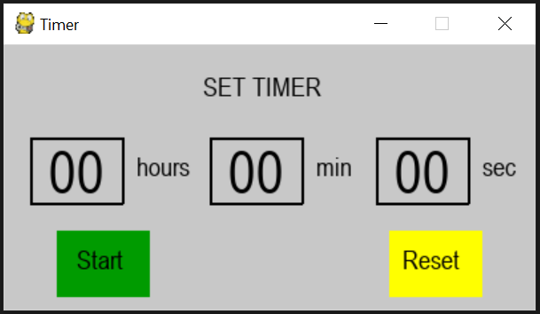

# Timer
### About
I wrote it on Pygame. You can press numbers to set timer and press Start to countdown the time. When the timer runs to 0, there will be a song played to let you know it's done. You can press Stop to stop the timer while it is counting down or press Reset to reset a new timer.
### Screenshot
This is how it looks like:

### Try it!
You can download the game (Timer.zip)from [Release](https://github.com/socolachaymo/Timer/releases/tag/0.0) and run the timer.exe file
